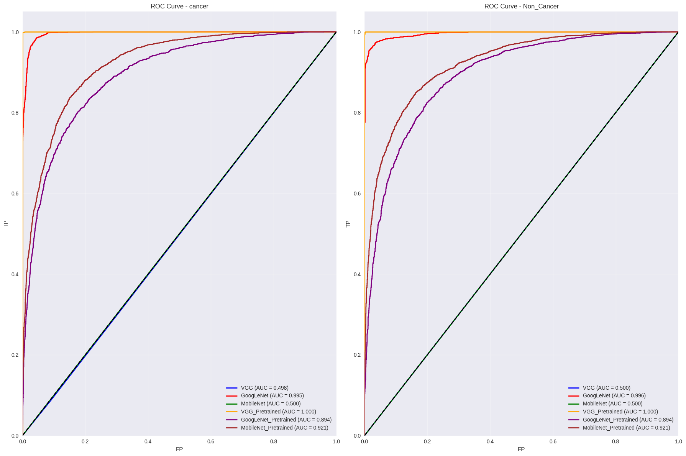
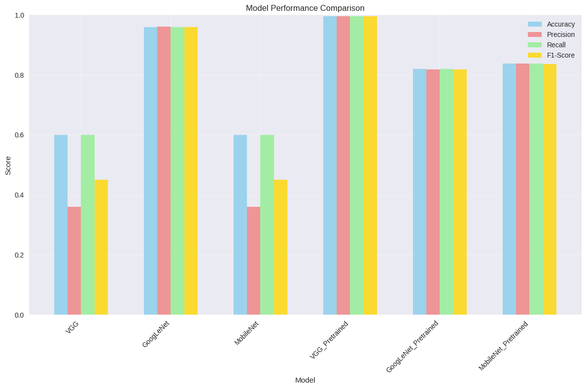

# Colon Cancer Classification

Ce dépôt contient le code Python pour un projet de modélisation visant à classifier le cancer du côlon à partir d'images histopathologiques. Le projet explore l'utilisation de réseaux neuronaux convolutifs (CNN), y compris des modèles pré-entraînés, pour la détection et la classification des cellules cancéreuses du côlon.

## But du Projet

L'objectif principal de ce projet est de développer un modèle de classification capable de reconnaître avec précision la présence ou l'absence de cellules cancéreuses du côlon dans des images histopathologiques. Cela implique :

* **Prétraitement des données** : Préparer les images pour l'entraînement du modèle (redimensionnement, normalisation, augmentation de données).
* **Exploration de modèles** : Tester et comparer différentes architectures de réseaux neuronaux convolutifs (CNN), y compris des modèles construits de zéro et des modèles pré-entraînés (transfer learning) sur des jeux de données volumineux.
* **Évaluation des performances** : Mesurer l'efficacité des modèles à l'aide de métriques pertinentes telles que la précision, la sensibilité, la spécificité, l'aire sous la courbe ROC (AUC) et la matrice de confusion.

Le `cv-ccvc-models.ipynb` notebook contient les étapes détaillées de l'exploration des données, de la préparation, de la construction du modèle, de l'entraînement et de l'évaluation pour la classification du cancer du côlon.

## Performances des Modèles

Les modèles pré-entraînés se sont avérés très efficaces pour cette tâche de classification d'images médicales. Cela est dû à leur capacité à tirer parti des caractéristiques génériques apprises sur des jeux de données d'images très larges, ce qui permet une adaptation plus rapide et plus performante à un nouveau domaine spécifique comme l'histopathologie, même avec un jeu de données plus petit.

Voici les résultats de performance des modèles évalués :

### Courbes ROC des Modèles

La courbe ROC (Receiver Operating Characteristic) est un outil graphique essentiel pour évaluer la performance d'un classificateur binaire à différents seuils. Une courbe plus proche du coin supérieur gauche indique une meilleure performance.

### Performances Générales du Modèle

Ce graphique récapitule les métriques de performance clés (telles que la précision, le rappel, le F1-score) pour chaque modèle, offrant une vue d'ensemble de leur efficacité dans la classification du cancer du côlon.

## Auteur

[JUILLARD Thibaut]
